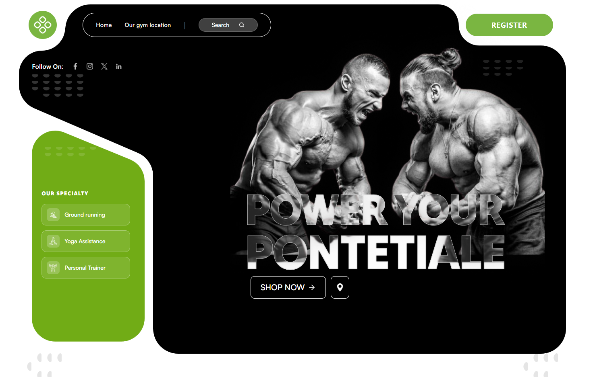
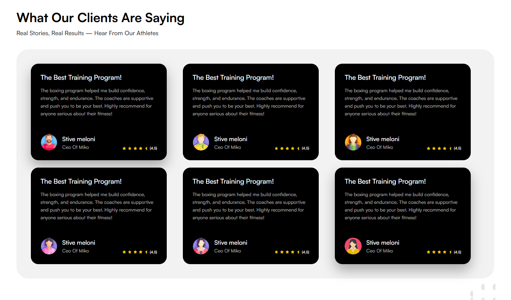
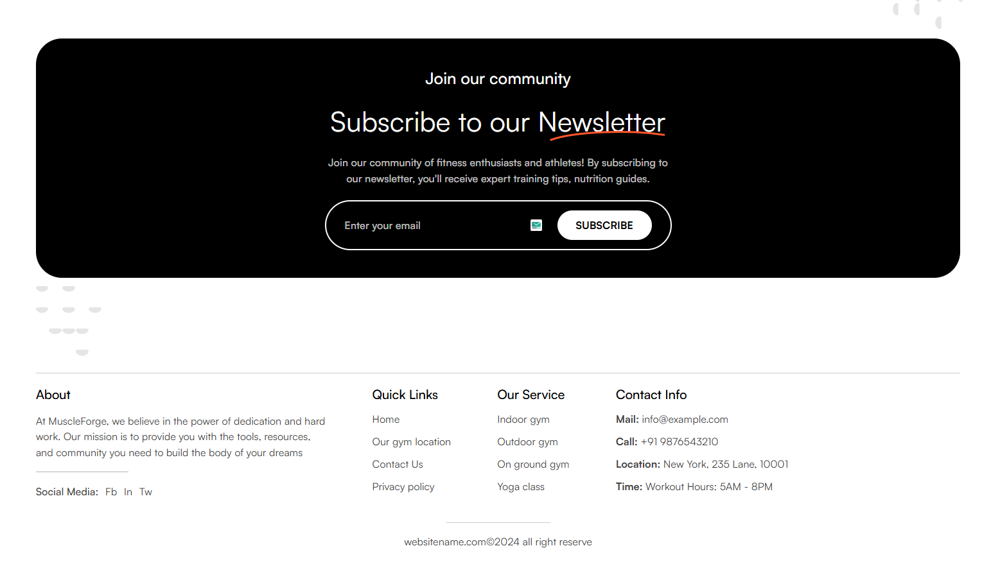
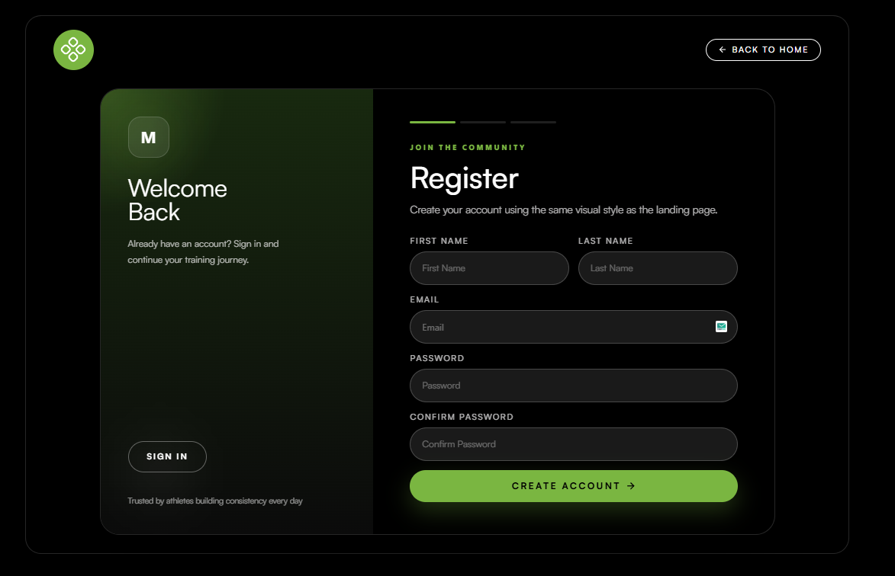
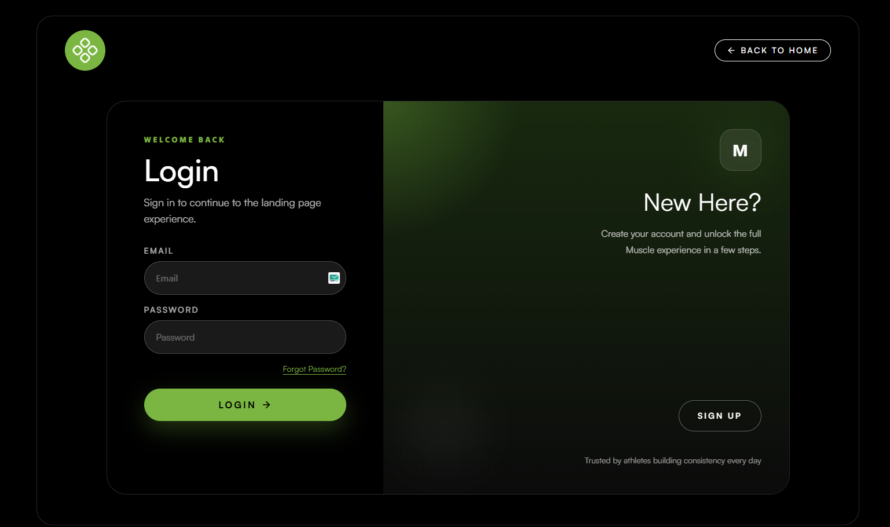

# Muscle Task Frontend

Frontend implementation for the landing page and authentication flow described in [SPEC.md](./SPEC.md).

## Live Links

- GitHub repository: add your public repo URL here
- Live deployment: add your Vercel or Netlify URL here

## Project Setup

### Requirements

- Node.js 18+ recommended
- npm

### Install

```bash
npm install
```

### Run in Development

```bash
npm run dev
```

### Build for Production

```bash
npm run build
```

### Preview Production Build

```bash
npm run preview
```

## Environment Notes

The auth layer supports both real API mode and mock mode.

Create a `.env` file if you want to override the defaults:

```env
VITE_AUTH_MODE=mock
VITE_AUTH_API_BASE_URL=https://frontend_api_test.test
VITE_AUTH_ALT_BASE_URL=https://apitest.softvencefsd.xyz
```

### Current API Status

The hostnames provided in the original task were not reachable from this environment when verified on April 8, 2026:

- `https://frontend_api_test.test`
- `https://apitest.softvencefsd.xyz`

Because of that, the frontend includes a mock auth mode so the full user flow can still be demonstrated.

## Tools and Packages Used

### Core

- React 19
- Vite 6
- React Router DOM 6

### Forms and State

- React Hook Form
- React Context API
- `useReducer`

### UI and Motion

- Tailwind CSS 4
- Framer Motion
- Lenis
- Lucide React

### Fonts

- Tilt Warp via Google Fonts
- Satoshi via Fontshare

## Implemented Features

- Landing page based on the provided design reference
- Register page styled to match the landing page
- Login page styled to match the landing page
- OTP verification flow using OTP from API response in mock mode
- Forgot password and reset password flow
- Auth state persistence with local storage
- Protected auth/session handling
- Smooth scrolling
- Motion enhancements across the UI
- Toast feedback for login and registration failure states

## Screenshots

### Design Reference


### App Screenshots









## Project Structure

```text
src/
  components/
  context/
  lib/
  pages/
  routes/
public/
SPEC.md
TASK.md
Frontend API Test.postman_collection.json
```

## Submission Notes

- The UI was kept aligned with the existing landing page design language.
- The auth API layer is centralized and ready for real endpoints once reachable URLs are available.
- Mock mode exists only because the provided backend hosts were unreachable during implementation.
